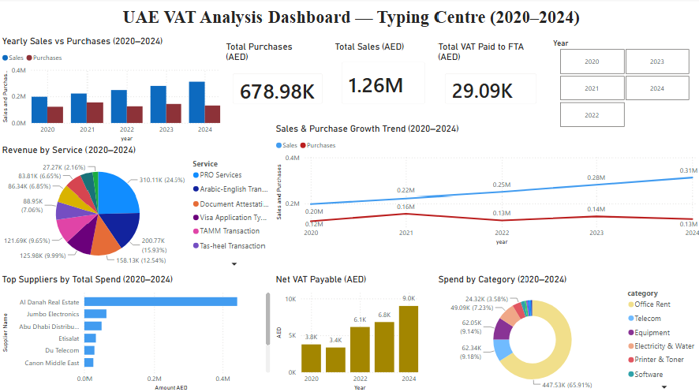

# 🧾 UAE VAT Data Analysis — Typing Centre (2020–2024)

## Overview
End-to-end data analysis project on 5 years of VAT billing data 
from a UAE typing centre. Covers data cleaning, exploratory 
analysis, business insights, and an interactive Power BI dashboard.

## Project Flow
Raw Messy Data → Python Cleaning → Analysis → Power BI Dashboard

## Tools Used
- Python (Pandas, NumPy, Matplotlib)
- Power BI Desktop
- Excel (openpyxl)
- Google Colab

## Key Findings
- 📈 **57.4% revenue growth** from 2020 to 2024
- 💰 **AED 1.26M total sales** over 5 years
- 🧾 **AED 29,086 VAT paid to FTA** — positive every year
- 💵 **AED 581,722 gross profit** over 5 years
- 🏢 Al Danah Real Estate = largest cost at AED 441,697
- 🏆 PRO Services = top revenue stream at AED 310,112

## Challenges & Fixes
1. Mixed date formats silently dropped 215 sales dates — fixed with `format="mixed"`
2. Nullable `Float64` crashed outlier detection — cast to `float64`
3. Global IQR flagged 90 rows — switched to per-category, cut to 13
4. Corrupt amounts removed rather than imputed — tax data integrity
5. Validation caught rounding mismatch — compared rounded-to-rounded

## Files
| File | Description |
|------|-------------|
| `Messy_VAT_5Years.xlsx` | Raw uncleaned data (Purchases + Sales) |
| `VAT_Cleaning_5Years_FINAL.ipynb` | Full cleaning pipeline |
| `VAT_Cleaned_5Years.xlsx` | Cleaned, validated data |
| `VAT_Analysis_5Years.ipynb` | EDA and business insights |
| `VAT_Analysis_Results.xlsx` | Yearly summary outputs |
| `UAE_VAT_Dashboard.pbix` | Interactive Power BI dashboard |

## Dashboard Preview

## Data Note
Data is synthetic but modelled after real UAE VAT billing 
structures observed during internship experience at a UAE 
typing centre (5% standard rate, FTA quarterly filing format).
